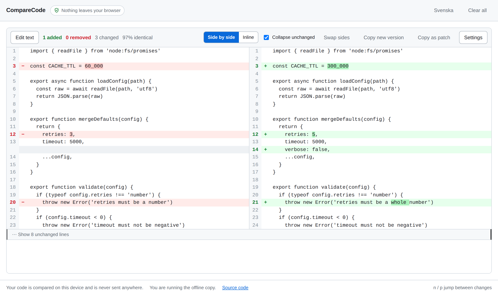

# CompareCode

Compare two versions of some code and see exactly what changed — in your browser,
without your code ever leaving it.

**[Open CompareCode →](https://timpan8.github.io/CompareCode/)**



## Mark which version is which

Paste into an empty pane and CompareCode asks one question: **is this the old code
or the new code?** Answer once and the new version moves to the right, where it
always stays. The other pane is labelled immediately, so you can see where the
second version goes before you paste it — the question is never asked twice.

Each pane also remembers whether it was the first or second text you entered, and
that label follows the text if it changes sides. "Which one did I paste first?"
always has an answer.

Drop two files in instead and their timestamps are used to suggest the order,
which you can override with one click.

## Your code stays here

- **It is never sent anywhere.** The comparison runs entirely in your browser.
  There are no API calls, no analytics, no fonts or icons loaded from anyone
  else's server, no accounts and no upload.
- **The only thing GitHub sees is that you fetched the page**, the same as
  visiting any website. What you paste afterwards never goes near it.
- **If you would rather not even do that**, download `CompareCode.html` — one
  file with everything inside it — disconnect from the network entirely and open
  it by double-clicking. Same app, no server involved.

That is a strong claim, so it is checked rather than asserted:

1. **The page forbids itself from connecting.** It ships a Content-Security-Policy
   of `default-src 'none'; connect-src 'none'; form-action 'none'`, which makes
   the browser refuse `fetch`, `XMLHttpRequest`, `WebSocket`, `EventSource` and
   `sendBeacon` — even if a bug or a future mistake tried to use one.
2. **The build is audited before release** (`npm run audit:offline`). The script
   parses the finished file and fails the build on any network API, dynamic
   import, absolute URL, resource hint or source-map reference. Four URLs are
   allowed, [written out in full](scripts/audit-bundle.mjs); three are XML
   namespace identifiers and the fourth is the link back to this repository.
3. **A browser test proves it end to end.** Every network entry point is replaced
   with something that throws, a full paste-and-compare session is driven through
   the built file over `file://`, and the test fails if a single request is
   attempted.
4. **Almost nothing is shipped that we did not write.** The only runtime
   dependency is Preact (~4 kB). The diff engine is our own.
5. **Autosave stays on your machine.** Your text is kept in this browser's local
   storage so a closed tab does not lose your work, with a **Clear all** button
   and a switch to turn it off. It is never put in the URL either.

## What it does

- Side-by-side and inline views, switching to inline automatically when the
  window is too narrow for two columns.
- Unchanged code folded away, with the changes and a few lines of context left
  visible. Click to expand.
- Word-level highlighting inside a changed line — and none at all when a line was
  rewritten rather than edited, because marking most of a line is harder to read
  than marking none of it.
- Ignore indentation, trailing spaces, all whitespace, blank lines or letter case.
  Line numbers stay real whatever you ignore.
- A map of the changes down the right edge, and `n` / `p` to jump between them.
- Copy the new version cleanly, or the whole comparison as a unified patch.
- Light and dark themes, a colour-blind-safe palette, and `+` / `−` markers so
  colour is never the only signal.
- English and Swedish.

## Running it

| | |
|---|---|
| **Hosted** | [timpan8.github.io/CompareCode](https://timpan8.github.io/CompareCode/) |
| **Offline** | Download `CompareCode.html` from the site's footer or from a CI build, then open the file directly. No install, no network. |
| **From source** | `npm install && npm run dev` |

```bash
npm run dev            # local development server
npm run build          # produces dist/index.html and dist/CompareCode.html
npm run verify         # typecheck + unit tests + build + offline audit
npm run test:e2e       # browser tests against the built file
```

The build is a single self-contained HTML file. It is deliberately a classic
script rather than an ES module: module scripts do not run at all from `file://`,
which would leave the downloadable copy silently doing nothing.

## How the comparison works

Getting a diff *correct* is easy; getting one that is pleasant to read takes a
few more decisions. The engine lives in [`src/core/diff`](src/core/diff) and has
no dependencies.

- **Histogram diff** (`histogram.ts`) picks where the changes are. Plain Myers
  minimises the number of changed lines, which in code means it will happily pair
  the wrong `}` and lay hunk boundaries through the middle of a block. Histogram
  anchors on the common run whose rarest line occurs fewest times, so it holds on
  to something meaningful even in a file full of braces. `myers.ts` takes over
  when there is genuinely no anchor.
- **The indent heuristic** (`slider.ts`) then slides each added or removed block
  to the position a person would have chosen: after a blank line, at a lower
  indentation, not into the middle of a deeper block.
- **Word-level detail** (`intraline.ts`) pairs changed lines by similarity rather
  than by position, diffs them by token, merges matches that only line up by
  coincidence, and gives up entirely when a line changed too much.
- **Everything is compared through a normalised key**, never by modifying your
  text, so what you see is always exactly what you pasted.

## Adding a tool

`src/core` is pure: no DOM, no browser globals, no dependencies, enforced by
[a test](tests/core-purity.test.ts). A tool is a pure `compute` plus a component,
registered together:

```ts
export const twoWayTool = createTwoWayTool(TwoWayView)
registerTool(twoWayTool)
```

The document store already holds a list rather than a pair, and `DiffResult`
already carries the change blocks and a similarity score, so the planned
additions are new files rather than rewrites:

- **Only the differences** — a view over the change blocks that are already
  computed.
- **Comparing three or more** — group identical documents by `fingerprint()`,
  show a similarity matrix, and open the ordinary two-way view for any pair.
- **Moved blocks**, syntax highlighting, regular-expression ignore filters, and
  moving the engine onto a worker for very large files.

## Credit

The scoring model and weights in `slider.ts` are those of git's indent heuristic
(`xdiff/xdiffi.c`, GPL-2.0), reimplemented in TypeScript — they were tuned
against diffs that humans had rated by hand, and are worth following rather than
guessing at. The word-level thresholds come from
[diff2html](https://github.com/rtfpessoa/diff2html), the fold defaults from
[CodeMirror's merge view](https://github.com/codemirror/merge), the idea of
cleaning up coincidental matches from
[diff-match-patch](https://github.com/google/diff-match-patch), and the
colour-blind-safe palette is Okabe-Ito.

## License

MIT — see [LICENSE](LICENSE).

---

## På svenska

CompareCode jämför två versioner av kod och visar tydligt vad som ändrats, utan
att koden lämnar din webbläsare. När du klistrar in i en tom ruta får du frågan om
det är den **gamla** eller **nya** koden — den nya hamnar alltid till höger, och
varje ruta minns om den var den du la in först eller sist.

Att inget skickas iväg är inte bara ett påstående: sidan förbjuder sig själv från
att kontakta nätet via en Content-Security-Policy, bygget granskas automatiskt och
underkänns om det innehåller nätverksanrop, och ett webbläsartest kör en hel
session med alla nätverksvägar blockerade. Vill du vara helt säker: ladda ner
`CompareCode.html`, dra ur nätverkssladden och dubbelklicka på filen.
